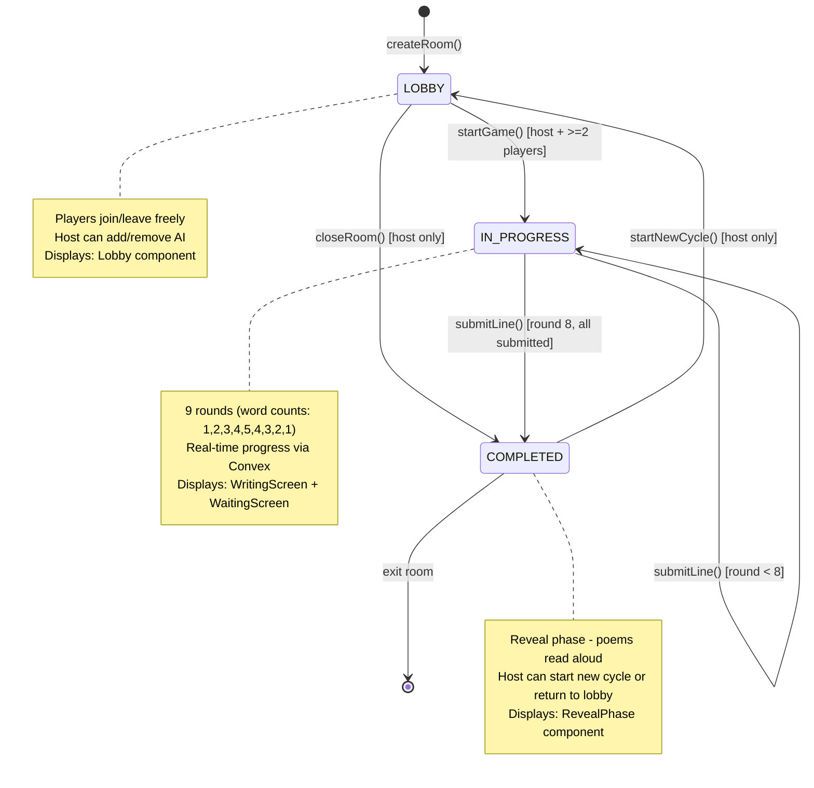
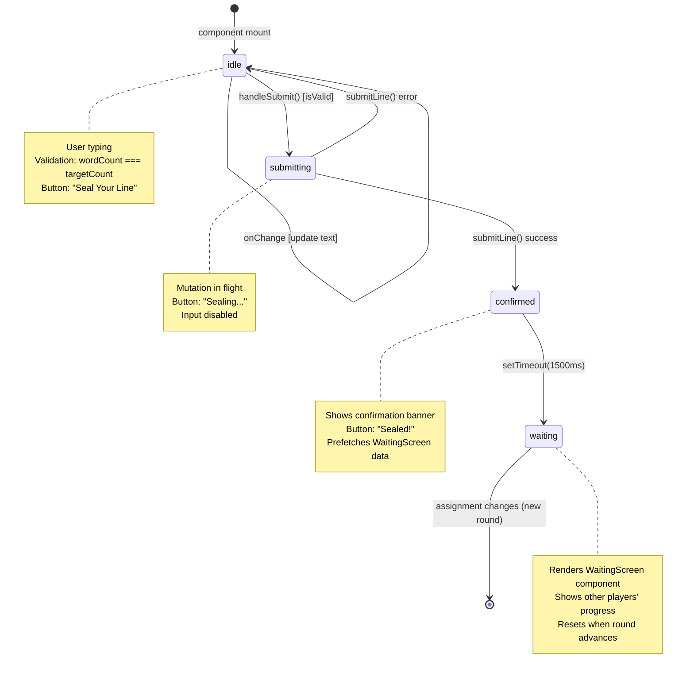
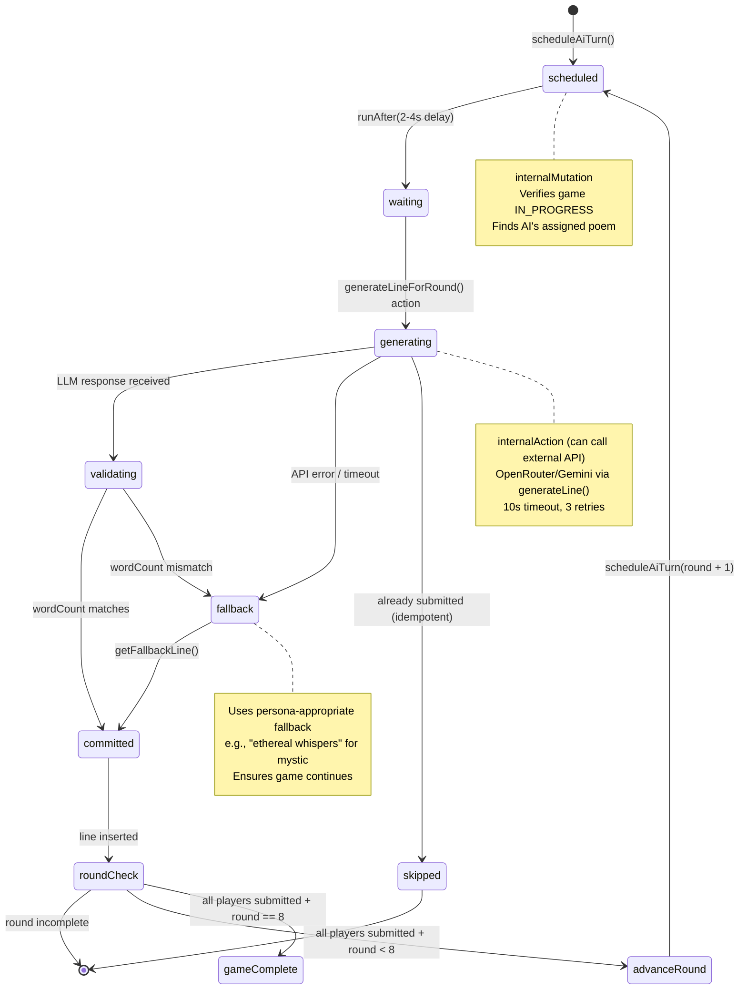
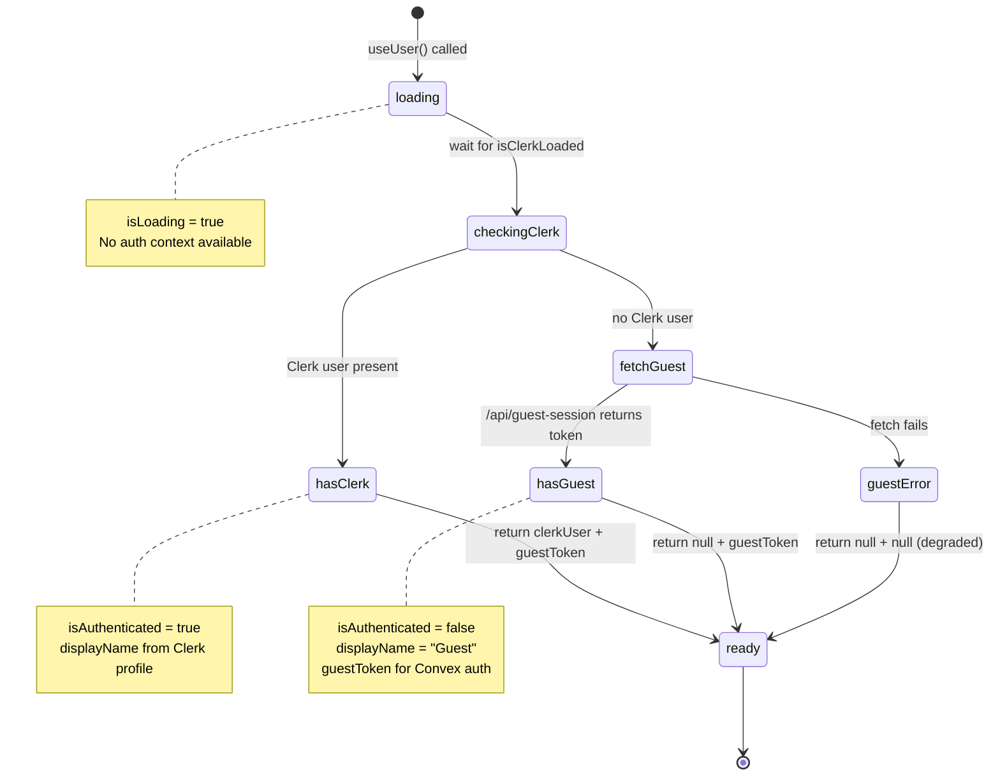
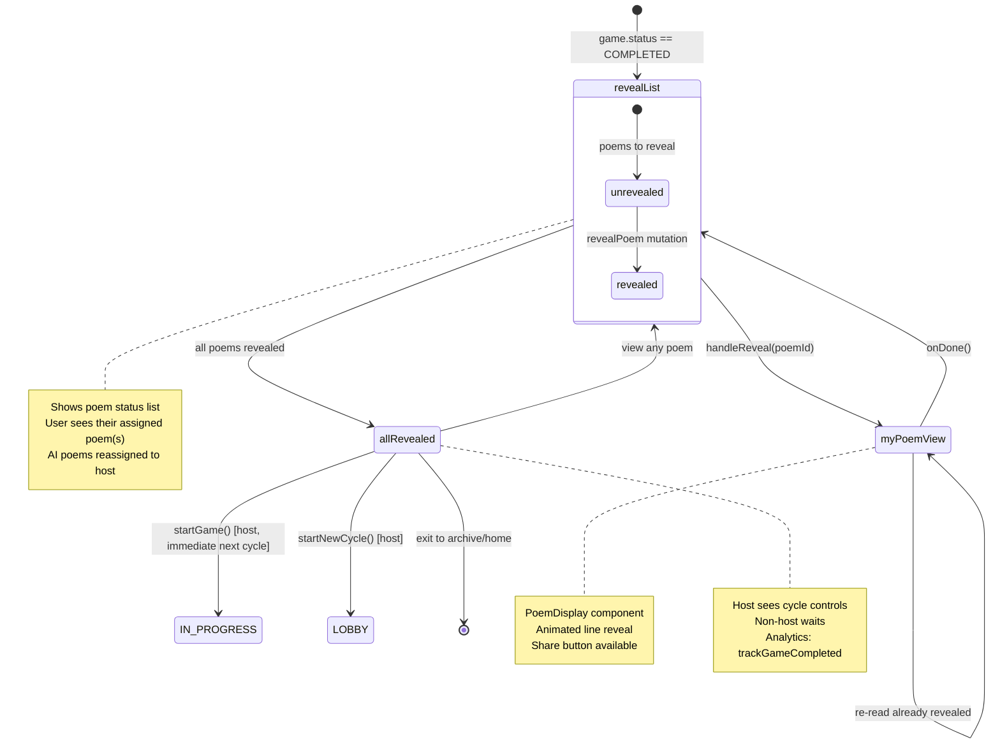
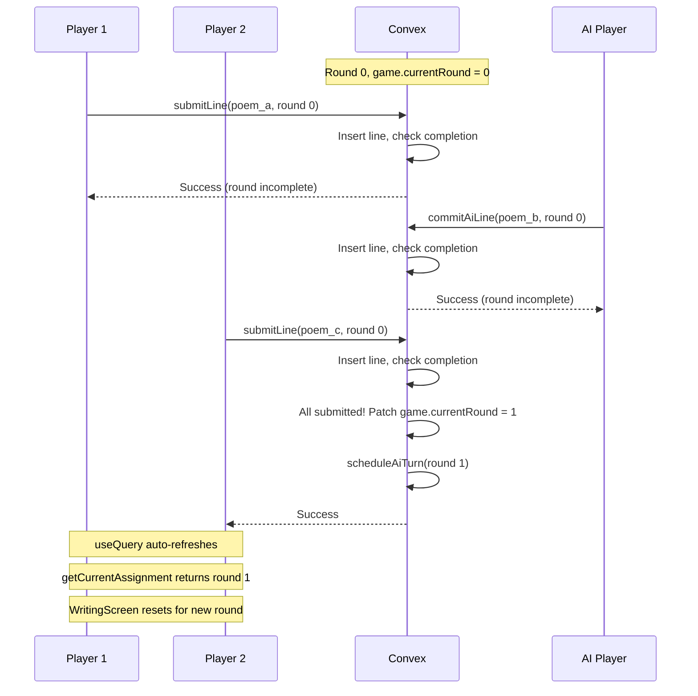
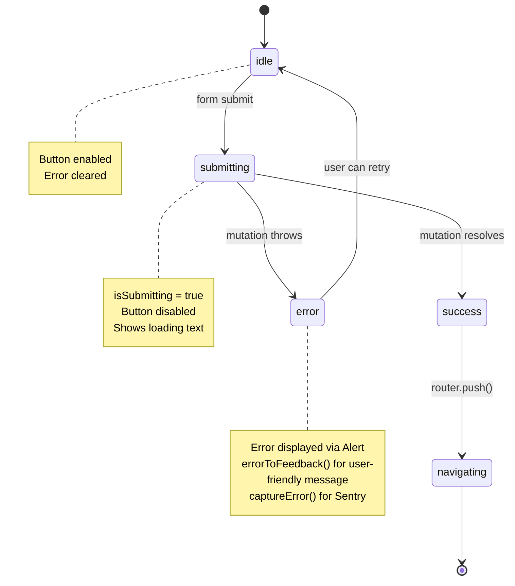

# State Diagrams

Mermaid diagrams documenting complex stateful flows in Linejam. Focus on flows with >3 states, non-linear transitions, or race condition potential.

## Room/Game State Machine

The core game lifecycle. Room status drives which component renders via `app/room/[code]/page.tsx`.



**Key Files:**

- Schema: `convex/schema.ts` (room.status enum)
- Mutations: `convex/game.ts` (startGame, submitLine, startNewCycle)
- Router: `app/room/[code]/page.tsx` (renders by status)

---

## WritingScreen Submission Flow

The `WritingScreen` component manages line submission with confirmation feedback.



**Race Condition Handling:**

- `submittedRound` tracks which round was submitted to prevent double-submit
- `lastSeenRound` resets state when assignment.lineIndex changes (new round)
- Convex `submitLine` is idempotent (checks existing line first)

**Key File:** `components/WritingScreen.tsx`

---

## AI Turn Generation Flow

The AI player turn lifecycle involves scheduling, external API calls, and graceful fallbacks.



**Key Files:**

- Scheduler: `convex/ai.ts` (scheduleAiTurn, generateLineForRound, commitAiLine)
- LLM: `convex/lib/ai/llm.ts` (generateLine, getFallbackLine)
- Personas: `convex/lib/ai/personas.ts`

---

## User Identity Resolution Flow

Hybrid auth supporting Clerk users and anonymous guests.



**Backend Resolution (convex/lib/auth.ts):**

```
getUser(ctx, guestToken):
  1. Try ctx.auth.getUserIdentity() (Clerk JWT)
  2. If found, lookup user by clerkUserId
  3. If not, verify guestToken signature
  4. Lookup user by guestId
  5. Return user or null
```

**Key Files:**

- Frontend hook: `lib/auth.ts`
- Backend helper: `convex/lib/auth.ts`
- Guest session: `app/api/guest-session/route.ts`

---

## Reveal Phase Flow

After game completion, players read poems aloud in sequence.



**Reader Assignment Logic (convex/lib/assignPoemReaders.ts):**

- Derangement: No one reads their own poem (author = first line writer)
- AI handling: AI poems reassigned to host
- Fair distribution when host has multiple

**Key Files:**

- Component: `components/RevealPhase.tsx`
- Display: `components/PoemDisplay.tsx`
- Assignment: `convex/lib/assignPoemReaders.ts`

---

## Round Progression (Data Flow)

How a round advances across the system.



**Key Invariant:** The `assignmentMatrix` is immutable once created. Round advancement only updates `game.currentRound`. This prevents race conditions in concurrent submissions.

---

## Form Submission States (Generic Pattern)

Common pattern used across Host, Join, and Lobby components.



**Used in:**

- `app/host/page.tsx` - createRoom
- `app/join/page.tsx` - joinRoom
- `components/Lobby.tsx` - startGame, addAi, removeAi, leaveLobby, closeRoom

---

## Undocumented Complex Flows (Future Work)

These flows are not yet diagrammed but may warrant attention:

1. **Theme System** - `lib/themes/context.tsx` manages theme + mode + system preference + localStorage persistence. Currently simple enough (light/dark/system toggle).

2. **Share Poem** - `hooks/useSharePoem.ts` is a simple clipboard + analytics fire-and-forget. Linear flow.

3. **Favorites** - Archive page favorites are simple toggle mutations.

4. **Rate Limiting** - `convex/lib/rateLimit.ts` is stateless check per mutation.
