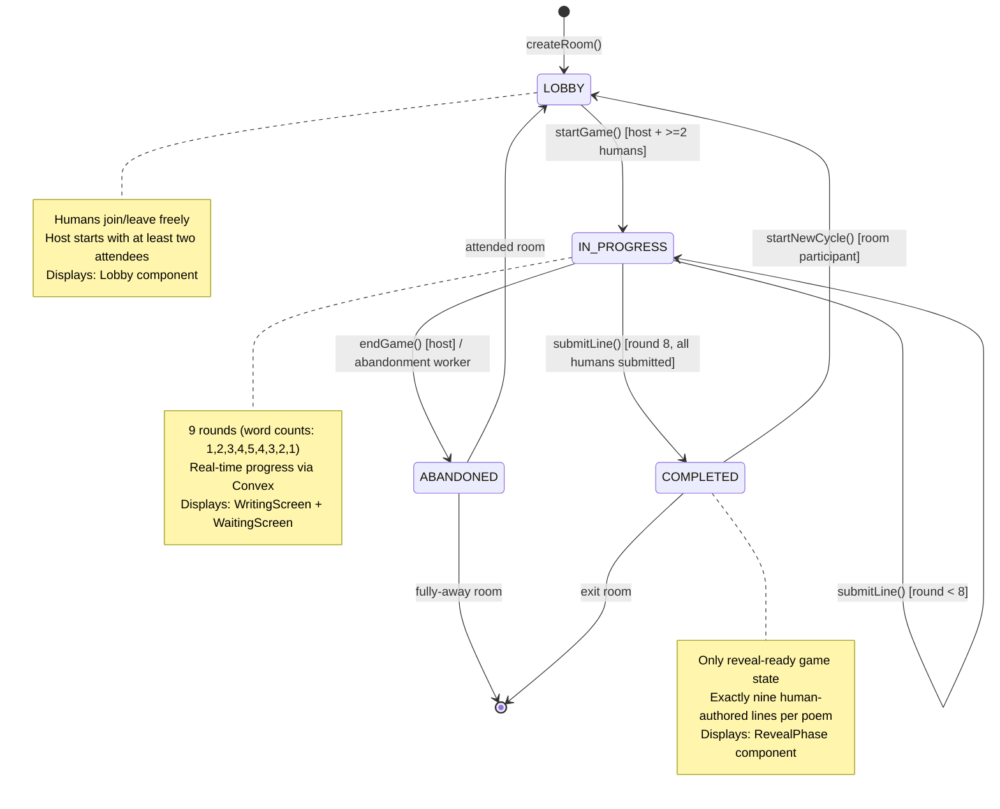
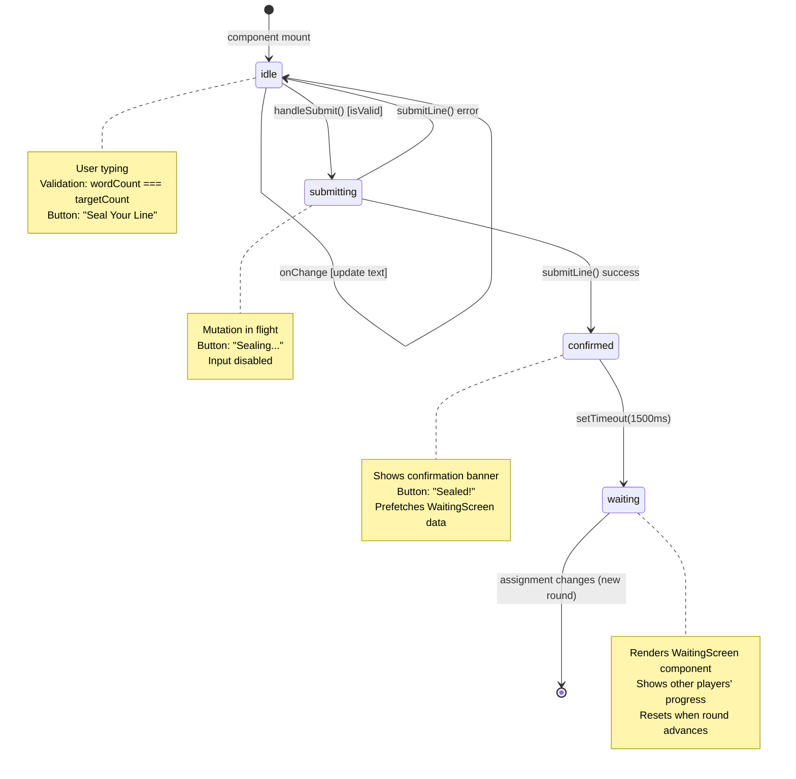
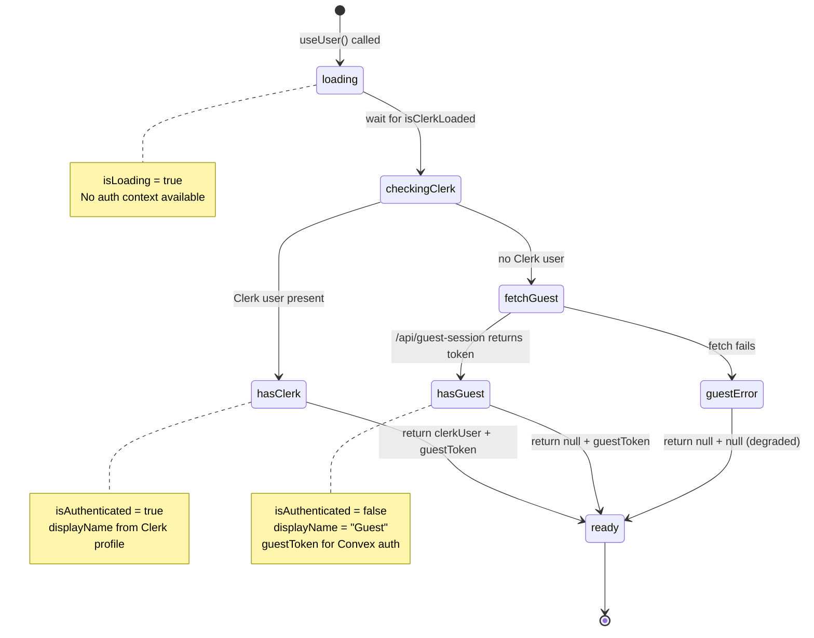
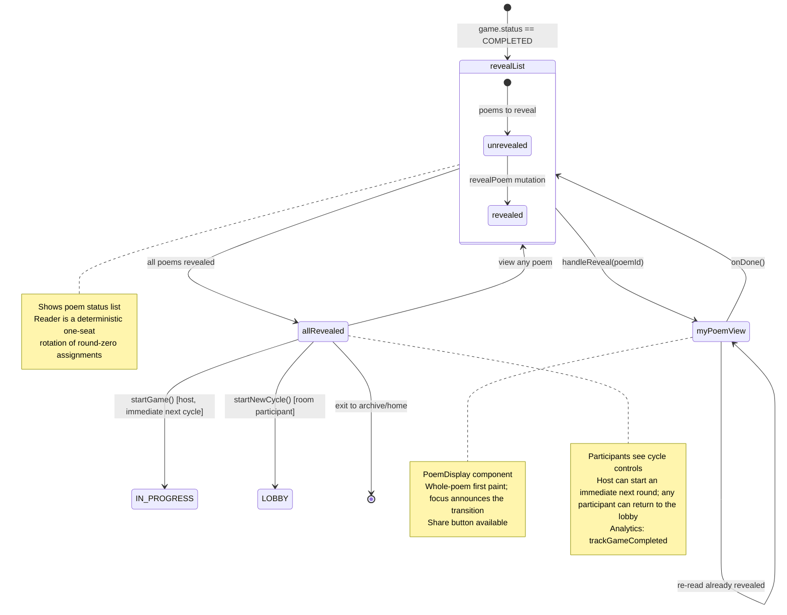
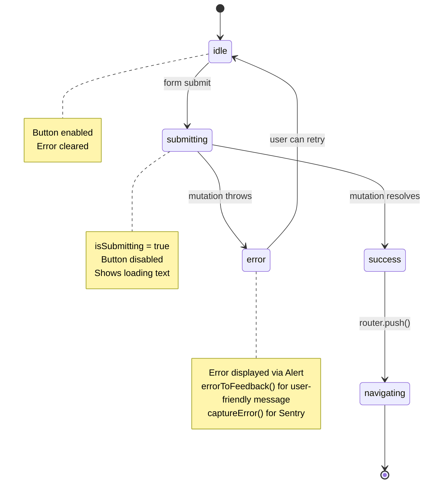

# State Diagrams

Mermaid diagrams documenting complex stateful flows in Linejam. Focus on flows with >3 states, non-linear transitions, or race condition potential.

## Room/Game State Machine

The room and active game lifecycle drives which component renders via `app/room/[code]/page.tsx`.


```mermaid
stateDiagram-v2
    [*] --> LOBBY : createRoom()

    LOBBY --> IN_PROGRESS : startGame() [host + >=2 humans]

    IN_PROGRESS --> IN_PROGRESS : submitLine() [round < 8]
    IN_PROGRESS --> COMPLETED : submitLine() [round 8, all humans submitted]
    IN_PROGRESS --> ABANDONED : endGame() [host] / abandonment worker

    ABANDONED --> LOBBY : attended room
    ABANDONED --> [*] : fully-away room
    COMPLETED --> LOBBY : startNewCycle() [room participant]
    COMPLETED --> [*] : exit room

    note right of LOBBY
        Humans join/leave freely
        Host starts with at least two attendees
        Displays: Lobby component
    end note

    note right of IN_PROGRESS
        9 rounds (word counts: 1,2,3,4,5,4,3,2,1)
        Real-time progress via Convex
        Displays: WritingScreen + WaitingScreen
    end note

    note right of COMPLETED
        Only reveal-ready game state
        Exactly nine human-authored lines per poem
        Displays: RevealPhase component
    end note
```

**Key Files:**

- Schema: `convex/schema.ts` (room.status enum)
- Mutations: `convex/game.ts` (startGame, submitLine, startNewCycle)
- Router: `app/room/[code]/page.tsx` (renders by status)

---

## WritingScreen Submission Flow

The `WritingScreen` component manages line submission with confirmation feedback.


```mermaid
stateDiagram-v2
    [*] --> idle : component mount

    idle --> submitting : handleSubmit() [isValid]
    idle --> idle : onChange [update text]

    submitting --> confirmed : submitLine() success
    submitting --> idle : submitLine() error

    confirmed --> waiting : setTimeout(1500ms)

    waiting --> [*] : assignment changes (new round)

    note right of idle
        User typing
        Validation: wordCount === targetCount
        Button: "Seal Your Line"
    end note

    note right of submitting
        Mutation in flight
        Button: "Sealing..."
        Input disabled
    end note

    note right of confirmed
        Shows confirmation banner
        Button: "Sealed!"
        Prefetches WaitingScreen data
    end note

    note right of waiting
        Renders WaitingScreen component
        Shows other players' progress
        Resets when round advances
    end note
```

**Race Condition Handling:**

- `submittedRound` tracks which round was submitted to prevent double-submit
- `lastSeenRound` resets state when assignment.lineIndex changes (new round)
- Convex `submitLine` is idempotent (checks existing line first)

**Key File:** `components/WritingScreen.tsx`

---

## User Identity Resolution Flow

Hybrid auth supporting Clerk users and anonymous guests.


```mermaid
stateDiagram-v2
    [*] --> loading : useUser() called

    loading --> checkingClerk : wait for isClerkLoaded

    checkingClerk --> hasClerk : Clerk user present
    checkingClerk --> fetchGuest : no Clerk user

    fetchGuest --> hasGuest : /api/guest-session returns token
    fetchGuest --> guestError : fetch fails

    hasClerk --> ready : return clerkUser + guestToken
    hasGuest --> ready : return null + guestToken
    guestError --> ready : return null + null (degraded)

    ready --> [*]

    note right of loading
        isLoading = true
        No auth context available
    end note

    note right of hasClerk
        isAuthenticated = true
        displayName from Clerk profile
    end note

    note right of hasGuest
        isAuthenticated = false
        displayName = "Guest"
        guestToken for Convex auth
    end note
```

**Backend Resolution (convex/lib/auth.ts):**

```
getUser(ctx, guestToken):
  1. Try ctx.auth.getUserIdentity() (Clerk JWT)
  2. If found, lookup user by clerkUserId
  3. If not, verify guestToken signature
  4. Lookup user by guestId
  5. Return user or null
```

**Key Files:**

- Frontend hook: `lib/auth.ts`
- Backend helper: `convex/lib/auth.ts`
- Guest session: `app/api/guest-session/route.ts`

---

## Reveal Phase Flow

After game completion, players read poems aloud in sequence.


```mermaid
stateDiagram-v2
    [*] --> revealList : game.status == COMPLETED

    revealList --> myPoemView : handleReveal(poemId)

    myPoemView --> revealList : onDone()
    myPoemView --> myPoemView : re-read already revealed

    revealList --> allRevealed : all poems revealed

    allRevealed --> revealList : view any poem
    allRevealed --> IN_PROGRESS : startGame() [host, immediate next cycle]
    allRevealed --> LOBBY : startNewCycle() [room participant]
    allRevealed --> [*] : exit to archive/home

    state revealList {
        [*] --> unrevealed : poems to reveal
        unrevealed --> revealed : revealPoem mutation
    }

    note right of revealList
        Shows poem status list
        Reader is a deterministic one-seat
        rotation of round-zero assignments
    end note

    note right of myPoemView
        PoemDisplay component
        Whole-poem first paint; focus announces the transition
        Share button available
    end note

    note right of allRevealed
        Participants see cycle controls
        Host can start an immediate next round; any participant can return to the lobby
        Analytics: trackGameCompleted
    end note
```

**Reader Assignment Logic (`convex/lib/assignPoemReaders.ts`):**

- Deterministic one-seat rotation of round-zero assignments
- Every attending human receives the next seat's poem when N >= 2

**Key Files:**

- Component: `components/RevealPhase.tsx`
- Display: `components/PoemDisplay.tsx`
- Assignment: `convex/lib/assignPoemReaders.ts`

---

## Round Progression (Data Flow)

How a round advances across the system.

```mermaid
sequenceDiagram
    participant P1 as Player 1
    participant P2 as Player 2
    participant P3 as Player 3
    participant C as Convex

    Note over C: Round 0, game.currentRound = 0

    P1->>C: submitLine(poem_a, round 0)
    C->>C: Insert line, check human assignments
    C-->>P1: Success (round incomplete)

    P2->>C: submitLine(poem_b, round 0)
    C->>C: Insert line, check human assignments
    C-->>P2: Success (round incomplete)

    P3->>C: submitLine(poem_c, round 0)
    C->>C: Insert line, check human assignments
    C->>C: All humans submitted; patch currentRound = 1
    C-->>P3: Success

    Note over P1,P3: useQuery auto-refreshes
    Note over P1,P3: getCurrentAssignment returns round 1
    Note over P1,P3: WritingScreen resets for new round
```

**Key Invariant:** The `assignmentMatrix` is immutable once created. Round advancement only updates `game.currentRound`. This prevents race conditions in concurrent submissions.

---

## Form Submission States (Generic Pattern)

Common pattern used across Host, Join, and Lobby components.


```mermaid
stateDiagram-v2
    [*] --> idle

    idle --> submitting : form submit

    submitting --> success : mutation resolves
    submitting --> error : mutation throws

    success --> navigating : router.push()

    error --> idle : user can retry

    navigating --> [*]

    note right of idle
        Button enabled
        Error cleared
    end note

    note right of submitting
        isSubmitting = true
        Button disabled
        Shows loading text
    end note

    note right of error
        Error displayed via Alert
        errorToFeedback() for user-friendly message
        captureError() for Sentry
    end note
```

**Used in:**

- `app/host/page.tsx` - createRoom
- `app/join/page.tsx` - joinRoom
- `components/Lobby.tsx` - startGame, leaveLobby, closeRoom

---

## Undocumented Complex Flows (Future Work)

These flows are not yet diagrammed but may warrant attention:

1. **Theme System** - `lib/themes/context.tsx` manages theme + mode + system preference + localStorage persistence. Currently simple enough (light/dark/system toggle).

2. **Share Poem** - `hooks/useSharePoem.ts` is a simple clipboard + analytics fire-and-forget. Linear flow.

3. **Favorites** - Archive page favorites are simple toggle mutations.

4. **Rate Limiting** - `convex/lib/rateLimit.ts` is stateless check per mutation.
